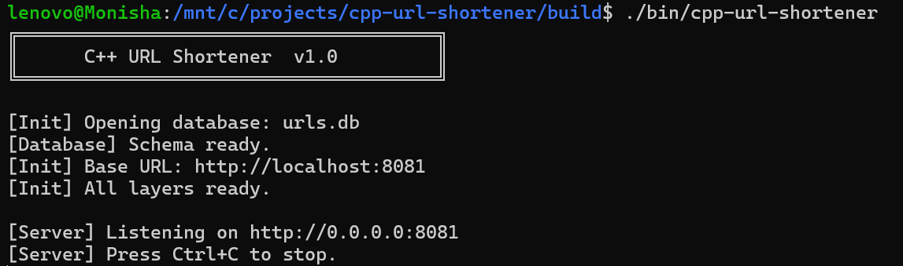
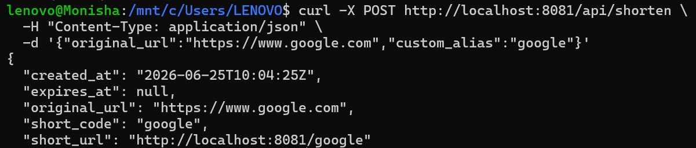
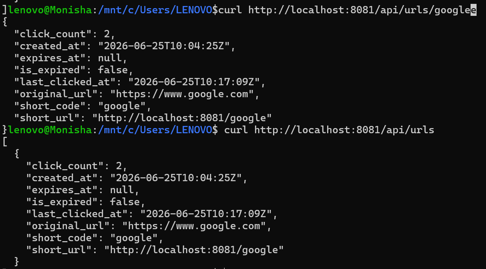

# cpp-url-shortener

A fully-featured, production-quality URL shortener backend written in **C++17**.
No frameworks, no JavaScript, no Docker — just clean C++ compiled with CMake and
running locally on Linux or WSL.

---

## Table of Contents

1. [Architecture](#architecture)
2. [Tech Stack](#tech-stack)
3. [Prerequisites](#prerequisites)
4. [Setup & Build](#setup--build)
5. [Running the Server](#running-the-server)
6. [API Reference](#api-reference)
7. [curl Examples & Expected Responses](#curl-examples--expected-responses)
8. [Testing](#testing)
9. [Project Structure](#project-structure)
10. [Database Schema](#database-schema)
11. [Demo / Screenshots](#demo--screenshots)

---

## Architecture

```
┌─────────────────────────────────────────────────────────────┐
│                       HTTP Client                           │
│              (curl / browser / Postman)                     │
└─────────────────────────┬───────────────────────────────────┘
                          │  HTTP Request/Response
                          ▼
┌─────────────────────────────────────────────────────────────┐
│                    HttpServer (Layer 3)                      │
│                   src/http_server.cpp                        │
│                                                             │
│  Routes:                                                    │
│  POST /api/shorten       → handleShorten()                  │
│  GET  /:code             → handleRedirect()  (302)          │
│  GET  /api/urls          → handleGetAllUrls()               │
│  GET  /api/urls/:code    → handleGetUrlStats()              │
│  DELETE /api/urls/:code  → handleDeleteUrl()                │
│                                                             │
│  Parses JSON  ·  Serialises responses  ·  Maps exceptions   │
│  to HTTP status codes (400 / 404 / 410 / 500)              │
│                                                             │
│  Library: cpp-httplib (single-header)                       │
│           nlohmann/json (single-header)                     │
└─────────────────────────┬───────────────────────────────────┘
                          │  C++ method calls
                          ▼
┌─────────────────────────────────────────────────────────────┐
│                   UrlService (Layer 2)                       │
│                   src/url_service.cpp                        │
│                                                             │
│  Business rules:                                            │
│  ✔ Validate URL scheme (http:// or https:// only)          │
│  ✔ Validate / generate short codes (6-char base62)         │
│  ✔ Reject duplicate custom aliases                          │
│  ✔ Reject past expiry timestamps                            │
│  ✔ Check expiry on redirect                                 │
│  ✔ Record clicks on every redirect                          │
│                                                             │
│  Throws typed exceptions:                                   │
│    ValidationError  →  HTTP 400                             │
│    NotFoundError    →  HTTP 404                             │
│    ExpiredError     →  HTTP 410                             │
└─────────────────────────┬───────────────────────────────────┘
                          │  C++ method calls
                          ▼
┌─────────────────────────────────────────────────────────────┐
│                    Database (Layer 1)                        │
│                    src/database.cpp                          │
│                                                             │
│  RAII wrappers around the sqlite3 C API:                    │
│  • SqliteStatement  – auto-finalises prepared statements    │
│  • Database         – auto-closes the connection            │
│                                                             │
│  Thread-safety: std::mutex guards every sqlite3 call        │
│  SQL injection: all values bound with sqlite3_bind_*        │
│  WAL journal mode for concurrent read performance           │
└─────────────────────────┬───────────────────────────────────┘
                          │  sqlite3 C API
                          ▼
┌─────────────────────────────────────────────────────────────┐
│              SQLite3 Database  (urls.db)                     │
│                                                             │
│  Table: urls                                                │
│  id · short_code · original_url · created_at               │
│  expires_at · click_count · last_clicked_at                 │
└─────────────────────────────────────────────────────────────┘
```

---

## Tech Stack

| Component      | Library / Tool              | Version   |
|----------------|-----------------------------|-----------|
| Language       | C++17                       | –         |
| HTTP server    | cpp-httplib                 | v0.15.3   |
| JSON           | nlohmann/json               | v3.11.3   |
| Database       | SQLite3                     | system    |
| Build system   | CMake                       | ≥ 3.16    |

---

## Prerequisites

Run these commands once on a fresh Ubuntu 22.04 / 24.04 install or WSL:

```bash
# System packages
sudo apt update
sudo apt install -y \
    build-essential \   # gcc, g++, make
    cmake \             # build system
    libsqlite3-dev \    # SQLite3 headers + library
    curl \              # used by setup.sh to download headers
    git                 # optional – for cloning this repo
```

Verify your versions:

```bash
g++ --version        # should say C++ compiler, any recent version
cmake --version      # should be 3.16 or later
sqlite3 --version    # e.g. 3.37.2
```

---

## Setup & Build

### Step 1 – Clone / Download the project

```bash
git clone https://github.com/yourname/cpp-url-shortener.git
cd cpp-url-shortener
```

### Step 2 – Download third-party single-header libraries

This downloads `httplib.h` and `nlohmann/json.hpp` into `third_party/`.

```bash
bash scripts/setup.sh
```

Expected output:

```
=== cpp-url-shortener: third-party setup ===
  Target directory: /path/to/project/third_party

[DOWNLOAD] cpp-httplib v0.15.3 …
[OK]   third_party/httplib.h
[DOWNLOAD] nlohmann/json v3.11.3 …
[OK]   third_party/nlohmann/json.hpp

=== Setup complete! You can now build: ===
   mkdir -p build && cd build
   cmake .. -DCMAKE_BUILD_TYPE=RelWithDebInfo
   cmake --build . --parallel
```

### Step 3 – Configure with CMake

```bash
mkdir -p build
cd build
cmake .. -DCMAKE_BUILD_TYPE=RelWithDebInfo
```

Expected output (last few lines):

```
-- Build type: RelWithDebInfo
-- Found SQLite3: /usr/lib/x86_64-linux-gnu/libsqlite3.so (found version "3.37.2")
-- Found Threads: TRUE
--
--   cpp-url-shortener ready:
--     SQLite3 version  : 3.37.2
--     Binaries will be : /path/to/project/build/bin/
--
-- Configuring done
-- Build files have been written to: /path/to/project/build
```

### Step 4 – Compile

```bash
# Still inside build/
cmake --build . --parallel

# Or using make directly:
make -j$(nproc)
```

Both executables land in `build/bin/`:

```
build/bin/cpp-url-shortener    ← the server
build/bin/test_url_service     ← the test suite
```

---

## Running the Server

```bash
# From the project root (database file urls.db created here)
./build/bin/cpp-url-shortener
```

Expected startup output:

```
╔══════════════════════════════════════╗
║      C++ URL Shortener  v1.0         ║
╚══════════════════════════════════════╝

[Init] Opening database: urls.db
[Database] Schema ready.
[Init] Base URL: http://localhost:8081
[Init] All layers ready.

[Server] Listening on http://0.0.0.0:8081
[Server] Press Ctrl+C to stop.
```

The server is now ready at **http://localhost:8081**.  
Press **Ctrl+C** to stop it gracefully.

---

## API Reference

### POST `/api/shorten`

Creates a shortened URL.

**Request body** (JSON):

```json
{
  "original_url": "https://example.com/very/long/path",
  "custom_alias": "my-link",
  "expires_at": 1735689600
}
```

| Field          | Type    | Required | Description                                              |
|----------------|---------|----------|----------------------------------------------------------|
| `original_url` | string  | ✅       | Must start with `http://` or `https://`                 |
| `custom_alias` | string  | ❌       | 1–50 chars, `[A-Za-z0-9_-]`. If omitted, auto-generated |
| `expires_at`   | integer | ❌       | Unix timestamp (seconds). Must be in the future         |

**Response** `201 Created`:

```json
{
  "short_code": "my-link",
  "short_url": "http://localhost:8081/my-link",
  "original_url": "https://example.com/very/long/path",
  "created_at": "2024-06-15T09:30:00Z",
  "expires_at": "2025-01-01T00:00:00Z"
}
```

---

### GET `/:short_code`

Redirects to the original URL.

- Returns **302 Found** with a `Location` header on success.
- Returns **404** if the code does not exist.
- Returns **410 Gone** if the link has expired.

---

### GET `/api/urls`

Lists every shortened URL with analytics.

**Response** `200 OK`:

```json
[
  {
    "short_code": "my-link",
    "short_url": "http://localhost:8081/my-link",
    "original_url": "https://example.com/very/long/path",
    "created_at": "2024-06-15T09:30:00Z",
    "expires_at": "2025-01-01T00:00:00Z",
    "click_count": 42,
    "last_clicked_at": "2024-06-15T11:00:00Z",
    "is_expired": false
  }
]
```

---

### GET `/api/urls/:short_code`

Returns detailed analytics for a single URL.

**Response** `200 OK`: same shape as one element of the list above.

**Response** `404 Not Found`:

```json
{
  "error": "Short code 'xyz' not found",
  "status": 404
}
```

---

### DELETE `/api/urls/:short_code`

Permanently removes a shortened URL.

**Response** `200 OK`:

```json
{
  "message": "URL deleted successfully",
  "short_code": "my-link"
}
```

**Response** `404 Not Found`: same error format as above.

---

## curl Examples & Expected Responses

Open a second terminal while the server is running.

### 1 – Shorten a URL (auto-generated code)

```bash
curl -s -X POST http://localhost:8081/api/shorten \
     -H "Content-Type: application/json" \
     -d '{"original_url": "https://www.github.com/torvalds/linux"}' \
  | python3 -m json.tool
```

Expected response:

```json
{
  "short_code": "aB3x7q",
  "short_url": "http://localhost:8081/aB3x7q",
  "original_url": "https://www.github.com/torvalds/linux",
  "created_at": "2024-06-15T09:30:00Z",
  "expires_at": null
}
```

---

### 2 – Shorten with a custom alias

```bash
curl -s -X POST http://localhost:8081/api/shorten \
     -H "Content-Type: application/json" \
     -d '{"original_url": "https://isocpp.org", "custom_alias": "cpp"}' \
  | python3 -m json.tool
```

Expected response:

```json
{
  "short_code": "cpp",
  "short_url": "http://localhost:8081/cpp",
  "original_url": "https://isocpp.org",
  "created_at": "2024-06-15T09:31:00Z",
  "expires_at": null
}
```

---

### 3 – Shorten with an expiry date

```bash
# Generate a timestamp 30 days from now
EXPIRES=$(date -d "+30 days" +%s)

curl -s -X POST http://localhost:8081/api/shorten \
     -H "Content-Type: application/json" \
     -d "{\"original_url\": \"https://cmake.org\", \"expires_at\": $EXPIRES}" \
  | python3 -m json.tool
```

---

### 4 – Follow a redirect (browser-like)

```bash
# -L makes curl follow the Location header
curl -L http://localhost:8081/cpp
# → fetches https://isocpp.org
```

Without following redirects:

```bash
curl -v http://localhost:8081/cpp 2>&1 | grep -E "HTTP|Location"
# < HTTP/1.1 302 Found
# < Location: https://isocpp.org
```

---

### 5 – List all URLs

```bash
curl -s http://localhost:8081/api/urls | python3 -m json.tool
```

Expected response:

```json
[
  {
    "short_code": "cpp",
    "short_url": "http://localhost:8081/cpp",
    "original_url": "https://isocpp.org",
    "created_at": "2024-06-15T09:31:00Z",
    "expires_at": null,
    "click_count": 1,
    "last_clicked_at": "2024-06-15T09:32:00Z",
    "is_expired": false
  },
  {
    "short_code": "aB3x7q",
    "short_url": "http://localhost:8081/aB3x7q",
    "original_url": "https://www.github.com/torvalds/linux",
    "created_at": "2024-06-15T09:30:00Z",
    "expires_at": null,
    "click_count": 0,
    "last_clicked_at": null,
    "is_expired": false
  }
]
```

---

### 6 – Get analytics for one URL

```bash
curl -s http://localhost:8081/api/urls/cpp | python3 -m json.tool
```

---

### 7 – Delete a URL

```bash
curl -s -X DELETE http://localhost:8081/api/urls/cpp | python3 -m json.tool
```

Expected response:

```json
{
  "message": "URL deleted successfully",
  "short_code": "cpp"
}
```

---

### 8 – Error: duplicate alias

```bash
curl -s -X POST http://localhost:8081/api/shorten \
     -H "Content-Type: application/json" \
     -d '{"original_url": "https://other.com", "custom_alias": "cpp"}' \
  | python3 -m json.tool
```

Expected response (`400 Bad Request`):

```json
{
  "error": "Custom alias 'cpp' is already in use",
  "status": 400
}
```

---

### 9 – Error: invalid URL scheme

```bash
curl -s -X POST http://localhost:8081/api/shorten \
     -H "Content-Type: application/json" \
     -d '{"original_url": "ftp://bad.example.com"}' \
  | python3 -m json.tool
```

Expected response (`400 Bad Request`):

```json
{
  "error": "Invalid URL: must begin with http:// or https://",
  "status": 400
}
```

---

### 10 – Error: code not found

```bash
curl -s http://localhost:8081/api/urls/doesnotexist | python3 -m json.tool
```

Expected response (`404 Not Found`):

```json
{
  "error": "Short code 'doesnotexist' not found",
  "status": 404
}
```

---

## Testing

### Run the unit test suite

```bash
# Option A – run the binary directly (coloured output)
./build/bin/test_url_service

# Option B – run via ctest (good for CI)
cd build
ctest --output-on-failure
```

Expected output:

```
╔══════════════════════════════════════╗
║   C++ URL Shortener  –  Unit Tests  ║
╚══════════════════════════════════════╝

── isValidUrl ──────────────────────────
  test_valid_url_accepts_https … PASS
  test_valid_url_accepts_http … PASS
  test_valid_url_rejects_other_schemes … PASS

── generateShortCode ───────────────────
  test_generate_short_code_length … PASS
  test_generate_short_code_charset … PASS
  test_generate_short_code_randomness … PASS

── shortenUrl (valid input) ────────────
  test_shorten_returns_correct_fields … PASS
  test_shorten_with_custom_alias … PASS
  test_shorten_with_expiry … PASS
  test_shorten_alias_with_hyphens_and_underscores … PASS

── shortenUrl (invalid input) ──────────
  test_shorten_invalid_scheme_throws … PASS
  test_shorten_duplicate_alias_throws … PASS
  test_shorten_past_expiry_throws … PASS
  test_shorten_alias_invalid_chars_throws … PASS
  test_shorten_empty_alias_throws … PASS

── getRedirectUrl ──────────────────────
  test_redirect_returns_correct_url … PASS
  test_redirect_increments_click_count … PASS
  test_redirect_records_last_clicked_at … PASS
  test_redirect_nonexistent_throws_not_found … PASS
  test_redirect_expired_url_throws_expired … PASS

── getAllUrls ───────────────────────────
  test_get_all_urls_empty … PASS
  test_get_all_urls_returns_all … PASS

── getUrlStats ─────────────────────────
  test_get_stats_correct_fields … PASS
  test_get_stats_nonexistent_throws … PASS

── deleteUrl ───────────────────────────
  test_delete_existing_url … PASS
  test_delete_nonexistent_throws … PASS
  test_delete_does_not_affect_other_records … PASS

══════════════════════════════════════════
  All 27 tests passed.
══════════════════════════════════════════
```

> **Note:** Tests use an in-memory SQLite database (`:memory:`), so they produce
> no files on disk and are fully isolated from each other.

---

## Project Structure

```
cpp-url-shortener/
│
├── CMakeLists.txt              ← Build configuration
├── .gitignore
├── README.md
│
├── scripts/
│   └── setup.sh                ← Downloads third-party headers
│
├── include/                    ← Public headers (interface only, no implementation)
│   ├── database.hpp            ← UrlRecord struct, Database class, SqliteStatement
│   ├── url_service.hpp         ← ShortenResult struct, UrlService class, exceptions
│   └── http_server.hpp         ← HttpServer class
│
├── src/                        ← Implementation files
│   ├── database.cpp            ← SQLite3 RAII layer
│   ├── url_service.cpp         ← Business logic, validation, code generation
│   ├── http_server.cpp         ← Route handlers, JSON serialisation
│   └── main.cpp                ← Entry point, wires layers together
│
├── tests/
│   └── test_url_service.cpp    ← 27 unit tests (no external framework)
│
└── third_party/                ← Created by setup.sh, git-ignored
    ├── httplib.h               ← cpp-httplib v0.15.3
    └── nlohmann/
        └── json.hpp            ← nlohmann/json v3.11.3
```

---

## Database Schema

```sql
CREATE TABLE IF NOT EXISTS urls (
    id              INTEGER PRIMARY KEY AUTOINCREMENT,
    short_code      TEXT    UNIQUE NOT NULL,
    original_url    TEXT    NOT NULL,
    created_at      INTEGER NOT NULL,       -- Unix timestamp (seconds)
    expires_at      INTEGER,                -- NULL means never expires
    click_count     INTEGER DEFAULT 0,
    last_clicked_at INTEGER                 -- NULL until first click
);

CREATE INDEX IF NOT EXISTS idx_short_code ON urls(short_code);
```

The database file (`urls.db`) is created in the working directory when the server
starts.  Delete it to reset all data.

---

## Demo / Screenshots

### Server Startup

```
╔══════════════════════════════════════╗
║      C++ URL Shortener  v1.0         ║
╚══════════════════════════════════════╝

[Init] Opening database: urls.db
[Database] Schema ready.
[Init] Base URL: http://localhost:8081
[Init] All layers ready.

[Server] Listening on http://0.0.0.0:8081
[Server] Press Ctrl+C to stop.
```

> 📸 _Add a screenshot of your terminal here after running the server._

### POST /api/shorten

> 📸 _Add a screenshot of the curl command and JSON response._

### Redirect in browser

> 📸 _Navigate to `http://localhost:8081/<your-code>` and show the browser
> redirecting to the original URL._

### GET /api/urls (analytics)

> 📸 _Add a screenshot showing the full JSON list with click_count populated._

---

## Troubleshooting

| Problem | Solution |
|---------|----------|
| `cmake: third_party/httplib.h not found` | Run `bash scripts/setup.sh` first |
| `error: sqlite3.h: No such file` | `sudo apt install libsqlite3-dev` |
| `Address already in use` on port 8081 | `lsof -i :8081` to find and kill the process |
| `cmake --version` shows < 3.16 | `sudo apt install cmake` (or use snap: `snap install cmake --classic`) |
| Tests say `FAIL` | Run `./build/bin/test_url_service` directly for coloured output |

---

---

## Demo Screenshots

### Server Running



### Create Short URL



### Redirect Success


### Click Analytics



---

## License

MIT – free to use, modify, and distribute.
